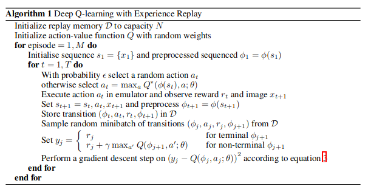

# DQN


1. Initialize replay memory D to capacity N
    ```py
    class replay_memory:
        def __init__(self, capacity):
            self.buffer = deque(maxlen=capacity)

        def store(self, state, action, reward, next_state, done):
            self.buffer.append([state.tolist(), action, reward, next_state.tolist(), done])

        def replay(self, size):
            return random.sample(list(self.buffer), size)

        def __len__(self):
            return len(self.buffer)
    ```
2. Initialize action-value function Q with random weights
    ```py
    class QNet:
        def __init__(self):
            self.l1 = nn.Linear(4, 128)
            self.l2 = nn.Linear(128, 128)
            self.l3 = nn.Linear(128, 2)

        def __call__(self, x):
            if not isinstance(x, Tensor):
                if isinstance(x, np.ndarray):
                    x = x.tolist()
                x = Tensor(x, requires_grad=True)
            x = self.l1(x).relu()
            x = self.l2(x).relu()
            x = self.l3(x)
            return x

        def act(self, x, epsilon):
            if np.random.random() < epsilon:
                return np.random.randint(2)
            else:
                q_values = self(x)
                act = q_values.argmax().cast(dtype=dtypes.int)
                return act.item()
    net = QNet()
    ```
3. Perform a gradient descent step on $(y_j − Q(\phi(j), a_j; θ))^2$ according to equation 3
    ```py
    batches = buffer.replay(size=batch_size)
    states, actions, rewards, new_states, done = zip(*batches)
    states = Tensor(list(states), requires_grad=True)
    new_states = Tensor(list(new_states), requires_grad=False)
    rewards = Tensor(list(rewards), requires_grad=True)
    actions = Tensor(list(actions), requires_grad=True)
    done = Tensor(list(done), requires_grad=True)
    q_values = net(states)
    q_value_next = net(new_state)
    q_value = Tensor(
        [i[act].numpy() for i, act in zip(q_values, actions)], requires_grad=True
    )
    y = rewards + gamma * (1 - done) * q_value_next.max(1)[0]
    gradient = (y - q_value).pow(2).mean()
    gradient.backward()
    ```