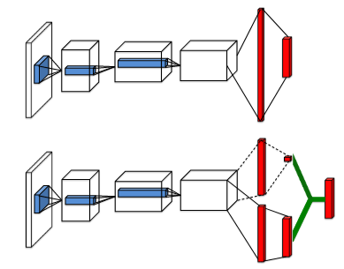
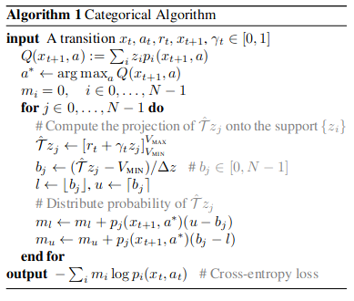

# Deep Q Learning

# Index

1. [List of Algorithms](#list-of-algorithms)
2. [Algorithms](#algorithms)
   - [DQN](#dqn)
   - [DDQN](#ddqn)
   - [PER](#per)
   - [Dueling DQN](#dueling-dqn)
   - [Noisy DQN](#noisy-dqn)
   - [Categorical DQN](#categorical-dqn-c51)
3. [References](#references)

# List of Algorithms

- [x] DQN
- [ ] DRQN
- [x] Double DQN (DDQN)
- [x] Dueling DQN
- [x] Prioritized Experience Replay (PER)
- [x] Noisy DQN
- [x] Categorial DQN
- [ ] Rainbow DQN

# Algorithms

## DQN


1. Initialize replay memory D to capacity N

   ```py
   class replay_memory:
       def __init__(self, capacity):
           self.buffer = deque(maxlen=capacity)

       def store(self, state, action, reward, next_state, done):
           self.buffer.append([state.tolist(), action, reward, next_state.tolist(), done])

       def replay(self, size):
           return random.sample(list(self.buffer), size)

       def __len__(self):
           return len(self.buffer)
   ```

2. Initialize action-value function Q with random weights

   ```py
    class QNet(nn.Module):
        def __init__(self):
            super(QNet, self).__init__()
            self.l = nn.Sequential(
                nn.Linear(4, 128),
                nn.ReLU(),
                nn.Linear(128, 128),
                nn.ReLU(),
                nn.Linear(128, 2),
            )

        def forward(self, x):
            return self.l(x)

        def act(self, x, epsilon):
            with torch.no_grad():
                if random.random() < epsilon:
                    return np.random.randint(2)
                else:
                    x = torch.FloatTensor(x)
                    q_values = self.forward(x)
                    act = q_values.argmax()
                    return act.item()

   net = QNet()
   ```

3. Perform a gradient descent step on $(y_j − Q(\phi(j), a_j; θ))^2$ according to equation 3
   ```py
   def gradient_descent():
        batches = buffer.replay(size=batch_size)
        states, actions, rewards, new_states, done = zip(*batches)
        states = torch.tensor(states)
        with torch.no_grad():
            new_states = torch.tensor(new_states)
        rewards = torch.FloatTensor(rewards)
        actions = torch.LongTensor(actions)
        done = torch.FloatTensor(done)
        q_values = net(states)
        q_value_next = net(new_states)
        q_value = q_values.gather(1, actions.unsqueeze(1)).squeeze(1)
        y = rewards + gamma * (1 - done) * q_value_next.max(1)[0]
        gradient = (y - q_value).pow(2).mean()
        optimizer.zero_grad()
        gradient.backward()
        optimizer.step()
   ```

## DDQN

$$
\begin{equation}
y_j = r_j + \gamma Q(S_{t+1}, argmax_{a'} Q(S_{t+1}, a'; \theta); \theta^-)
\end{equation}
$$

where $\theta^-$ are the parameters of the target network, which are only updated with the main network every $C$ steps.

Compared to DQN, the main difference is in gradient_descent function.

```py
q_values = net(states)
q_value_next = net(new_states)
q_value_next_target = target(new_states)


q_value = q_values.gather(1, actions.unsqueeze(1)).squeeze(1)
# Double DQN
# y = R + gamma Q(s', argmax_a Q(s', a))
_argmax = q_value_next_target.argmax(1)
y = rewards + gamma * (1 - done) * q_value_next[torch.arange(len(_argmax)), _argmax]
```

## PER


### Without Sum Tree

- $P(j)$
  - Prioritized
    - $P(j) = \frac{p_j^\alpha}{\sum_k p_k^\alpha}$
    - $p_j = |\delta_j| + \epsilon$
    ```py
    Pj = np.array(self.priorities) ** self.alpha
    sumPj = sum(Pj)
    Pj = Pj / sumPj
    ```
  - Rank-based
    - $P(j) = \frac{1}{rank(j)}$
    ```py
    Pj = np.array(self.priorities)
    sorted_indices = np.argsort(Pj)[::-1]
    ranks = np.empty_like(sorted_indices)
    ranks[sorted_indices] = np.arange(1, len(Pj) + 1)
    Pj = 1 / ranks
    ```
- $w_j = \frac{\left({N}. {P(j)}\right)^{-\beta}}{max_i w_i}$
  ```py
  wj = (self.N * _Pj) ** (-self.beta)
  wj = wj / max(wj)
  ```

## Dueling DQN



Changes compared to DQN:

Authors introduced:

```py
self.state = nn.Sequential(
    nn.Linear(128, 64),
    nn.ReLU(),
    nn.Linear(64, 1),
)
self.advantage = nn.Sequential(
    nn.Linear(128, 64),
    nn.ReLU(),
    nn.Linear(64, 2),
)
```

Forward function:

$Q(s,a;\theta,\alpha,\beta) = V(s;\theta,\beta) + \left(A(s,a;\theta,\alpha) - \frac{1}{|A|} \sum_{a'} A(s,a';\theta,\alpha)\right)$

Nice read: https://ai.stackexchange.com/questions/8128/questions-on-the-identifiability-issue-and-equations-8-and-9-in-the-d3qn-paper

## Noisy DQN

#### NoisyLinear Layer

Noisy Linear Layer is defined as: $y = (\mu^{w}+\sigma^w\odot\epsilon^w)x+(\mu^{b}+\sigma^b\odot\epsilon^b)$, where $\epsilon$ is a vector of zero-mean noise with fixed statistics and $\odot$ represents element-wise multiplication.

```py
class NoisyLinear(nn.Module):
    __constants__ = ["in_features", "out_features"]
    in_features: int
    out_features: int

    def __init__(
        self,
        in_features: int,
        out_features: int,
        device=None,
        dtype=None,
    ) -> None:
        factory_kwargs = {"device": device, "dtype": dtype}
        super().__init__()
        self.in_features = in_features
        self.out_features = out_features
        self.weight_mean = nn.Parameter(
            torch.empty((out_features, in_features), **factory_kwargs)
        )
        self.weight_std = nn.Parameter(
            torch.empty((out_features, in_features), **factory_kwargs)
        )
        self.bias_mean = nn.Parameter(torch.empty((out_features), **factory_kwargs))
        self.bias_std = nn.Parameter(torch.empty((out_features), **factory_kwargs))

        self.weight_noise = nn.Parameter(
            torch.empty((out_features, in_features), **factory_kwargs)
        )
        self.bias_noise = nn.Parameter(torch.empty((out_features), **factory_kwargs))

        self.reset_parameters()
        self.reset_noise()

    def reset_parameters(self) -> None:
        range = math.sqrt(3 / self.in_features)
        self.weight_mean.data.uniform_(-range, range)
        self.weight_std.data.fill_(0.017)
        self.bias_mean.data.uniform_(-range, range)
        self.bias_mean.data.fill_(0.017)

    def reset_noise(self):
        range = math.sqrt(1 / self.out_features)
        self.weight_noise.data.uniform_(-range, range)
        self.bias_noise.data.fill_(0.5 * range)

    def forward(self, x):
        if self.training:
            w = self.weight_mean + self.weight_std.mul(self.weight_noise)
            b = self.bias_mean + self.bias_std.mul(self.bias_noise)
        else:
            w = self.weight_mean
            b = self.bias_mean
        return nn.functional.linear(x, w, b)
```

Weight initialization (`reset_parameters`), and noise reset (`reset_noise`) follows:
Each element $\mu_{i,j}$ is sampled from independent uniform distributions $U[−\frac{\sqrt{3}}{p},+\frac{\sqrt{3}}{p}]$, where $p$ is the number of inputs to the corresponding linear layer, and each element $\sigma_{i,j}$ is simply set to 0.017 for all parameters.

For factorised noisy networks, each element $\mu_{i,j}$ was initialised by a sample from an independent uniform distributions $U[−\frac{\sqrt{1}}{p},+\frac{\sqrt{1}}{p}]$ and each element $\sigma_{i,j}$ was initialised to a constant $\frac{\sigma_0}{\sqrt{p}}$ . The hyperparameter $\sigma_0$ is set to 0.5.

## Categorical DQN (C51)


1. Finding Projection distribution
    ```python
    def projection_distribution(next_state, rewards, dones):
        batch_size = next_state.size(0)
        delta_z = (Vmax - Vmin) / (num_atoms - 1)
        support = torch.linspace(Vmin, Vmax, num_atoms).to(device)
        next_dist = target(next_state) * support
        next_act = next_dist.sum(2).max(1)[1]
        next_dist = next_dist[torch.arange(next_dist.size(0)), next_act.data]

        rewards = rewards.view(-1, 1).expand([batch_size, num_atoms])
        dones = dones.view(-1, 1).expand([batch_size, num_atoms])

        Tz = rewards + gamma * (1 - dones) * support
        Tz = Tz.clamp(min=Vmin, max=Vmax)
        bj = (Tz - Vmin) / delta_z
        l = torch.floor(bj).long()
        u = torch.ceil(bj).long()

        probl = next_dist * (u - bj)
        probu = next_dist * (bj - l)

        # Do not use a double for loop here, it slows down the program
        m = torch.zeros(batch_size, num_atoms).to(device)
        m.scatter_add_(1, l, probl)
        m.scatter_add_(1, u, probu)
        return m
    ```

2. Cross Entropy Loss
    ```python
    pro_dist = projection_distribution(next_states, rewards, done)

    dist =  net(states)
    dist = dist[torch.arange(len(actions)), actions]
    
    loss = (-(pro_dist * dist.clamp(min=1e-5, max=1 - 1e-5).log()).sum(-1)).mean()
    ```

[NOTE]: I tried this with atari, and it takes a lot of time compared to DQN while training. Authors of this paper mentioned that *For N = 51, our TensorFlow implementation trains at roughly 75% of DQN’s speed*. Another thing to note is if you find the code is slowing down with time, try reducing the buffer size.

# References

[1] [Playing Atari with Deep Reinforcement Learning](https://arxiv.org/pdf/1312.5602.pdf), Mnih et al, 2013. Algorithm: DQN.

[2] [Deep Reinforcement Learning with Double Q-learning](https://arxiv.org/pdf/1509.06461.pdf), Hasselt et al, 2015. Algorithm: DDQN.

[3] [Prioritized Experience Replay](https://arxiv.org/pdf/1511.05952.pdf), Schaul et al, 2015. Algorithm: PER.

[4] [Dueling Network Architectures for Deep Reinforcement Learning](https://arxiv.org/pdf/1511.06581.pdf), Wang et al, 2015. Algorithm: Dueling DQN.

[5] [Noisy Networks for Exploration](https://arxiv.org/pdf/1706.10295.pdf), Meire Fortunato et al, 2017, Algorithm: Noisy Networks

[6] [A Distributional Perspective on Reinforcement Learning](https://arxiv.org/pdf/1707.06887.pdf), Bellemare et al, 2017. Algorithm: Categorical DQN